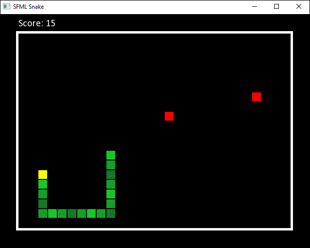

# Snake
A simple snake game made with C++ and SFML.  
The more food you eat, the longer the snake gets and the faster it moves! How long can you survive?

  
  
# Release Executable
If you just wish to play the game, a release executable is available [here.](https://github.com/Luke-LoPresti/SFML-Snake/releases/tag/1.0)  
  
# Requirements
**Please Note: Earlier versions may work.**  
  
### Dependencies
SFML 2.5.1 or above - http://www.sfml-dev.org/  

### MS Build
Microsoft Visual Studio 19 or above - https://visualstudio.microsoft.com/  
SFML Visual C++ 15 (2017) - 32-bit - http://www.sfml-dev.org/  
  
### Building
#### Method 1  
The SFML libraries are already statically linked within the project.  
A environment variable must be created called SFML_DIR which should point to the SFML root directory. Ex. SFML_DIR=C:\SFML-2.5.1  
1. Open the file Snake.sln.
1. Set the target to Debug or Release 32-bit (x86).
1. Build and run.  
  
#### Method 2
1. Open the file Snake.sln.
1. Follow the procedure to link the required SFML libraries outlined here (either dynamically or statically) - https://www.sfml-dev.org/tutorials/2.5/start-vc.php
1. Set the target to Debug or Release 32-bit (x86) based on which SFML libraries you linked from the above tutorial.
1. Build and run.  
